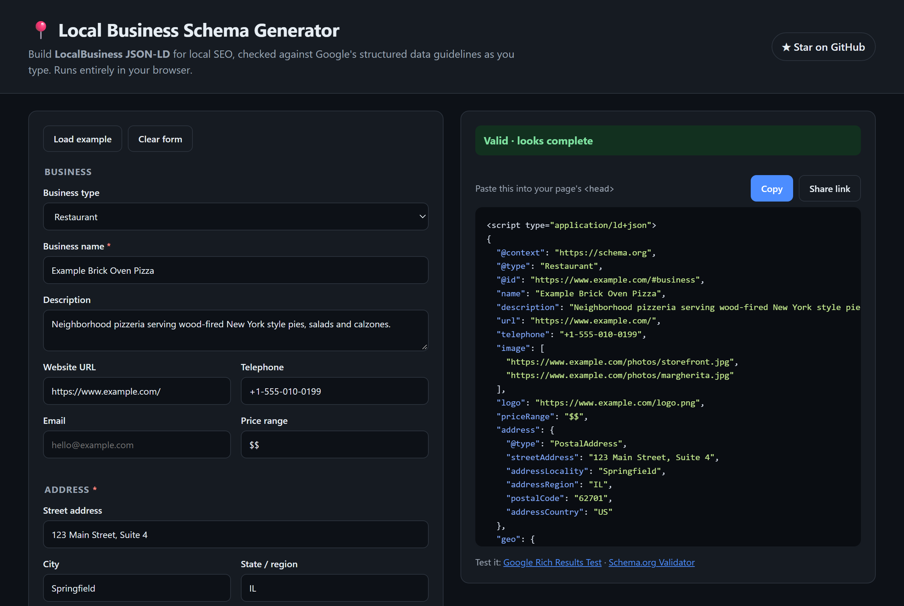

<div align="center">

# 📍 Local Business Schema Generator

**Build LocalBusiness JSON-LD for local SEO, validated against Google's structured data guidelines as you type.**

Free · open source · no sign-up · runs entirely in your browser

[](https://ahmettasdemirusa.github.io/local-business-schema-generator/)

[](LICENSE)




</div>

---

## Why

Search engines read **structured data** to understand a local business: what it is, where it is, when it is open and how to reach it. Most generators either hide it behind a sign-up or produce markup that Google quietly ignores: missing address fields, imprecise coordinates, or self-serving review stars that never show.

This tool writes the markup **and** tells you what is wrong with it, before you paste it into your site.

## Features

- **50+ business types**: restaurants, cafes, plumbers, HVAC, roofers, dentists, clinics, law firms, real estate, salons, gyms, auto repair, stores, hotels and more
- **Live validation** in three levels:
  - **errors**: Google can't use the markup
  - **warnings**: you lose a feature or a signal
  - **tips**: good practice
- **Opening hours editor**: closed days and 24-hour days use Google's conventions, and days with the same hours are grouped automatically
- **Restaurant fields** appear only for food businesses: `servesCuisine` and `menu` (both documented by Google), plus schema.org's `acceptsReservations`
- **Profiles and service areas**: `sameAs` links (Google Business Profile, Facebook, Instagram, Yelp) and `areaServed` cities
- **Share link**: the whole form is encoded in the URL, so you can send a draft to a client or a colleague
- **Private by design**: nothing leaves your browser; your last draft is kept in `localStorage`
- **Zero dependencies**: four static files, works offline, host it anywhere

## What it checks

| Check | Level |
|---|---|
| `name` and `address` present (Google's required properties) | error |
| Missing street, city, region, postal code or country | warning |
| URL is a valid `http(s)://` address; prefers `https` | error / tip |
| Telephone present; includes a country code | warning / tip |
| Latitude and longitude in range, with **at least 5 decimal places** | error / warning |
| `priceRange` shorter than 100 characters | warning |
| Opening and closing times are valid `HH:MM`, not identical | error / warning |
| Image, logo, map and profile links are full URLs | warning |
| Restaurants: cuisine and menu present; reservations value is yes, no or a URL | tip / warning |
| User text cannot break out of the `<script>` tag | always escaped |

Always confirm the final result with Google's [Rich Results Test](https://search.google.com/test/rich-results) and the [Schema.org Validator](https://validator.schema.org/).

## Use it

**Online:** open the [live demo](https://ahmettasdemirusa.github.io/local-business-schema-generator/), fill in the form, click **Copy** and paste the snippet into the `<head>` of the business's page.

**Locally:**

```bash
git clone https://github.com/ahmettasdemirusa/local-business-schema-generator.git
cd local-business-schema-generator
python -m http.server 8000   # or any static server
```

**In your own code:** `schema.js` has no DOM access and works in Node and in the browser:

```js
const LocalSchema = require('./schema.js');

const state = LocalSchema.exampleState();   // or build your own from defaultState()
state.name = 'Acme Plumbing';
state.type = 'Plumber';

const jsonLd = LocalSchema.build(state);        // plain object
const problems = LocalSchema.validate(state);   // [{ level, field, message }]
const html = LocalSchema.scriptTag(jsonLd);      // ready-to-paste <script> block
```

## Supported business types

Pick the most specific type that fits; Google recommends the most specific LocalBusiness subtype available.

- **General:** Local business (`LocalBusiness`), Professional service (`ProfessionalService`)
- **Food & drink:** Restaurant, Fast food restaurant, Cafe or coffee shop, Bakery, Bar or pub, Ice cream shop, Winery, Brewery
- **Home services & trades:** Plumber, Electrician, HVAC (`HVACBusiness`), Roofing contractor, General contractor, House painter, Locksmith, Moving company, Home & construction (`HomeAndConstructionBusiness`)
- **Health & medical:** Dentist, Physician, Medical clinic, Optician, Pharmacy, Veterinary care
- **Legal, finance & real estate:** Law firm / attorney (`LegalService`), Accounting service, Insurance agency, Financial service, Real estate agent
- **Beauty & fitness:** Beauty salon, Hair salon, Nail salon, Day spa, Health club, Gym (`ExerciseGym`)
- **Automotive:** Auto repair, Auto body shop, Auto dealer, Car wash (`AutoWash`)
- **Retail:** Store, Clothing store, Furniture store, Home goods store, Hardware store, Jewelry store, Florist
- **Lodging & care:** Hotel, Motel, Bed and breakfast, Child care

Missing a type? [Open an issue](https://github.com/ahmettasdemirusa/local-business-schema-generator/issues). Adding one is a one-line change in `schema.js`.

## FAQ

**What is LocalBusiness schema?**
It is structured data in the [schema.org](https://schema.org/LocalBusiness) vocabulary that tells search engines what a business is, where it is, when it is open and how to reach it. Google reads it in JSON-LD format, which is what this tool produces.

**Which properties does Google require?**
Only two: `name` and `address`. Google also recommends `geo`, `openingHoursSpecification`, `telephone`, `url`, `priceRange`, `menu` and `servesCuisine` where they apply. See Google's [local business structured data guide](https://developers.google.com/search/docs/appearance/structured-data/local-business).

**Where do I put the code?**
On the page for that business location, as a `<script type="application/ld+json">` block. The `url` should point to that location's own page.

**Will it improve my rankings?**
Structured data does not guarantee a ranking or a rich result. It helps Google understand the business and makes the page eligible for search features. Google bases local results mainly on relevance, distance and prominence, so keep your [Google Business Profile](https://support.google.com/business/answer/7091) complete and accurate as well.

**How do I mark a day as closed, or open 24 hours?**
The hours editor handles both for you. Following Google's convention, a closed day becomes `opens` and `closes` both `"00:00"`, and a 24-hour day becomes `"00:00"` to `"23:59"`. Hours that run past midnight, such as 18:00 to 03:00, go in a single entry.

**I have several locations. What should I do?**
Give each location its own page, and put a separate LocalBusiness block on each one.

**Can I add my Google reviews and star rating?**
No. Google does not show review stars for a local business that marks up reviews about itself. That includes embedded Google or Facebook review widgets. See Google's [review snippet guidelines](https://developers.google.com/search/docs/appearance/structured-data/review-snippet).

## Local SEO tips

- **Don't mark up reviews of your own business.** Google does not show review stars for a local business that marks up reviews about itself, and that includes embedded Google or Facebook review widgets.
- **Keep name, address and phone identical** on your site, your Google Business Profile and your directory listings.
- **One location, one page.** A business with several locations should give each one its own page and its own JSON-LD block.

## Development

```bash
node --test
```

| File | Purpose |
|---|---|
| `schema.js` | Builds and validates the JSON-LD. Pure logic, shared by the UI and the tests |
| `app.js` | Form, hours editor, live preview, share link |
| `index.html`, `style.css` | The page; light and dark themes follow the system setting |
| `test/` | Unit tests (`node --test`, no packages needed) |

Contributions are welcome. New business types, new checks and translations make especially good first pull requests. Please add a test with any new check.

## License

[MIT](LICENSE) © Ahmet Tasdemir

---

<div align="center">

If this saved you time, a ⭐ helps other people find it.

Built by **[Ahmet Tasdemir](https://github.com/ahmettasdemirusa)**, software engineer · [ahmettasdemir.com](https://ahmettasdemir.com)

</div>
